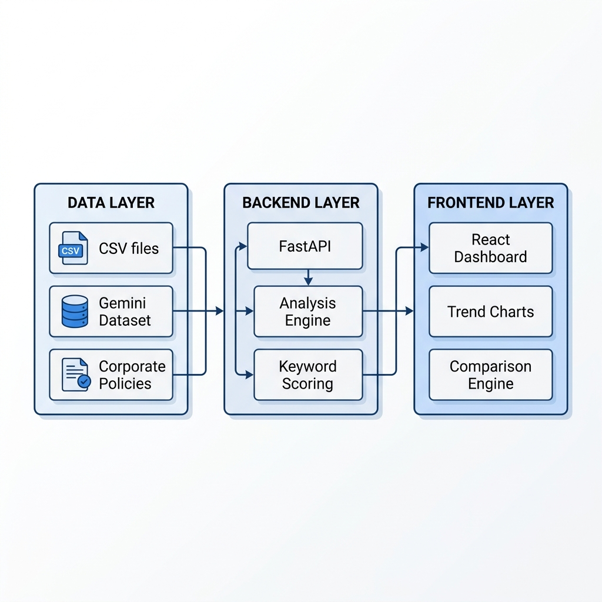
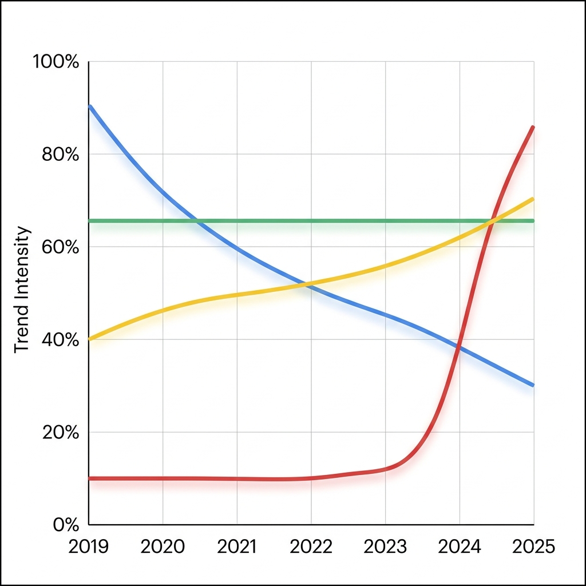
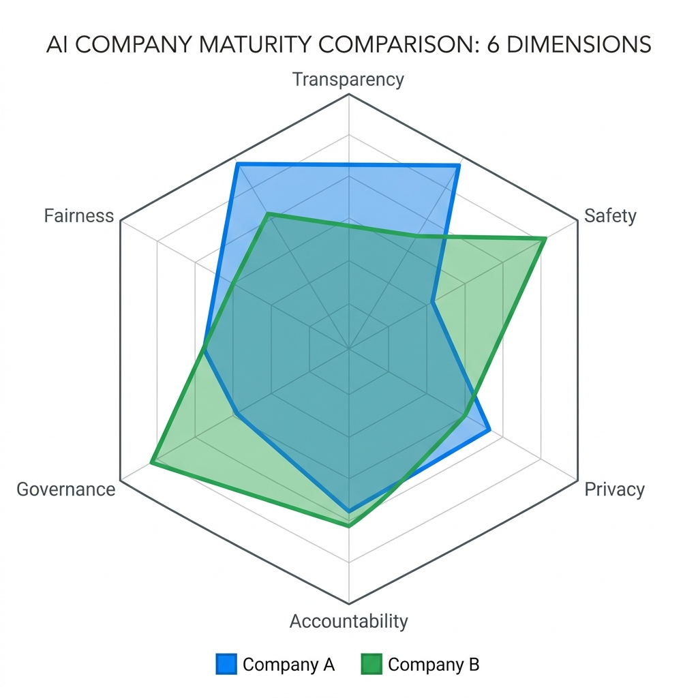

# Project Report: Apte (AI Principle Tracker Ethos)

**Automated Benchmarking and Longitudinal Analysis of Corporate AI Ethics Governance (2019–2025)**

---

## 1. Abstract
As Artificial Intelligence (AI) systems transition from academic research into the core infrastructure of the global digital economy, the governance frameworks guiding their development—corporate AI ethics policies—have seen a significant proliferation. However, these documents are often unstructured, dispersed across multiple corporate portals, and updated frequently, making manual monitoring impossible for stakeholders. This research presents **Apte (AI Principle Tracker Ethos)**, a robust full-stack automated system designed for the longitudinal and comparative analysis of AI ethics governance. Apte integrates two major data modalities: a comprehensive ethics keyword corpus for Gemini (2019–2025) comprising over 6,900 records, and structured policy datasets for leading AI corporations including Google, Microsoft, IBM, and OpenAI. Our methodology employs a hybrid approach combining keyword-frequency longitudinal tracking with a side-by-side comparison engine powered by baseline compliance scoring and explainable summarization. The paper demonstrates that by quantifying semantic shifts in corporate priorities, we can bridge the gap between high-level ethical principles and operational policy evidence. Results indicate a strategic shift from broad "fairness" principles in 2019 toward specific "safety" and "governance" controls in 2025.

---

## 2. Introduction

### The Problem of AI Governance Interpretability
The emergence of Large Language Models (LLMs) and the subsequent explosion of Generative AI applications have fundamentally altered the landscape of technological governance. For the first time, the "black box" nature of AI systems is a matter of urgent public concern, leading to a surge in corporate ethical commitments. Major technology providers now publish extensive "AI Principles" and "Responsible AI" reports to demonstrate their commitment to ethical development. However, these documents are often criticized by civil society and academic researchers for being "ethics washing"—symbolic gestures that lack operational accountability.

### The Interpretability Gap
The fundamental problem identified in this project is the **interpretability gap** in AI governance. Even when corporations are transparent, the sheer volume of documentation and the subtle nature of policy updates make it difficult for any single auditor or concerned citizen to track evolution or compare commitments between different providers in a structured, quantitative manner. This lack of structured evidence enables "symbolic compliance," where companies adopt the language of ethics without implementing the necessary technical or organizational controls.

### Objectives of the Apte System
To address this, we developed **Apte (AI Principle Tracker Ethos)**. Apte is not just a repository of documents; it is an automated benchmarking engine that treats corporate policy as a dynamic dataset. By quantifying the frequency, category, and severity of ethical keywords over a seven-year period (2019–2025), Apte surfaces the underlying priorities of AI providers. The system’s novelty lies in its dual-modality approach: it combines longitudinal "ethics signals" derived from a massive keyword corpus with a "side-by-side" comparison dashboard that allows users to benchmark two companies across six ethical pillars: Fairness, Transparency, Accountability, Privacy, Safety, and Governance.

### Research Questions
1.  **RQ1:** How have corporate AI ethics priorities shifted semantically between 2019 and 2025?
2.  **RQ2:** Can automated keyword-based scoring effectively distinguish the maturity of ethics governance between major AI providers?
3.  **RQ3:** To what extent can a decoupled full-stack architecture support real-time, explainable AI policy benchmarking for non-expert stakeholders?

---

## 3. Related Work: Critical Literature Review

### The Landscape of AI Ethics Guidelines
The academic study of AI ethics has moved through several distinct phases. Initial efforts focused on cataloging the "global landscape" of guidelines. **Jobin et al. (2019)** conducted a comprehensive inventory of 84 documents, identifying a convergence on five key principles: transparency, justice/fairness, non-maleficence, responsibility, and privacy. While valuable, this work highlights the primary limitation of current research: it is largely cross-sectional and manual. Jobin et al. noted that while there is consensus on what principles are important, there is almost no consensus on how to measure or enforce them.

### The "Principles to Practice" Gap
This gap is the central focus of **Mittelstadt’s (2019)** work. Mittelstadt argues that unlike medical ethics, which has an established professional code and institutional oversight, AI ethics lacks a professional infrastructure. This makes principle-based governance highly susceptible to corporate co-option. **Floridi et al. (2018)** attempted to bridge this by proposing the "AI4People" framework—a unified set of recommendations for a good AI society. However, frameworks like AI4People remain aspirational until they are paired with tools that can monitor their adoption in corporate policies.

### Critiquing "Ethics Washing"
The critical "anti-ethics" perspective, most notably championed by **Luke Munn (2022)**, suggests that "ethics" as a concept has become a defensive mechanism for big tech. Munn argues that ethics guidelines are often designed to be non-binding and vague enough to allow companies to continue business-as-usual. Apte’s methodology provides unique value here. By moving from the "text of the principle" to the "frequency of the keyword," we can identify when a company is merely using a buzzword versus when they are consistently incorporating specific governance controls (like "red-teaming" or "internal audit") into their policy framework.

### Evaluation Rubrics and Technical Solutions
The work of **Hagendorff (2020)** provides an evaluation rubric for ethics guidelines, scoring them on criteria such as "inclusion of technical solutions" and "legal backing." Hagendorff found that most guidelines are technically shallow. Our project operationalizes this critique by including a "Side-by-Side" comparison dashboard that specifically looks for technical governance keywords (e.g., "bias mitigation," "automated testing") and assigns scores based on their prevalence.

### Audit and Accountability
The **"AI Now Report" (2018)** and the work of **Raji et al. (2020)** on algorithmic auditing emphasize the need for transparency in how datasets and models are governed. Raji et al. identify that the "accountability gap" is often a result of poor documentation and internal communication. Apte addresses this by surfacing corporate documentation in a unified interface, allowing for external verification of whether a company’s public commitments align with the industry standard for accountable auditing.

### The Role of Professional Codes
Finally, we consider the human factor. **McNamara et al. (2018)** investigated whether the ACM’s Code of Ethics actually changed how developers made decisions. They found that merely having a code was insufficient. Our system incorporates a "User Review" framework, allowing stakeholders to rate company performance. This combines automated "keyword signals" with human "judgment signals," creating a more holistic view of governance than a single-source analysis could provide.

---

## 4. Methodology: Automated Longitudinal Observation

### A. Data Sources and Multi-Modality
The system utilizes three distinct data layers:
1.  **The Gemini Ethics Keyword Corpus (Longitudinal Layer):** Over 6,900 records spanning 2019–2025. Each record represents a specific ethics-related term (e.g., "explainability," "fairness," "harm-prevention") and its categorical mappings. This dataset allows us to see how the *language* of ethics has evolved within a major AI project (Gemini) over half a decade.
2.  **The Corporate Policy Dataset (Comparative Layer):** Structured policy points for Google, Microsoft, IBM, Amazon, Tesla, and OpenAI. Each entry is tagged with a Category, Severity, and Status.
3.  **The User Ratings Layer (Human Layer):** A JSON-based storage system capturing user ratings across Fairness, Transparency, Privacy, and Accountability.

### B. Data Preprocessing and Normalisation
A significant challenge was the heterogeneity of the data (word-level vs. sentence-level). The `EthicsDataService` (Python/FastAPI) performs:
-   **Case-Insensitive Normalisation:** Standardizing signals across datasets.
-   **Category Mapping:** Mapping dispersed terms like "biosecurity" and "jailbreaking" to the unified "Safety" pillar.
-   **Longitudinal Aggregation:** Grouping Gemini keywords by year and calculating "Category Density."

### C. System Architecture
-   **Backend:** FastAPI for high performance and asynchronous processing. It orchestrates CSV ingestion, baseline scoring, and session history.
-   **Frontend:** React + TypeScript + Vite. A dashboard-centric UI using Recharts for trend visualization.
-   **Modular Services:** The `BaselineService` (scoring logic) and `SessionService` (history management) are decoupled to allow for easy extension (e.g., swapping mocks for real LLMs).

*Figure 1: Apte System Architecture: Data flows from CSV sources through the FastAPI backend to the React-based visual dashboard.*

### D. Comparison and Scoring Algorithm (The KCS Engine)
The side-by-side comparison engine implements a **Keyword Coverage Scoring (KCS)** algorithm:
1.  Extracts policy points and keywords for both companies.
2.  Groups them into the six pillars: Fairness, Transparency, Accountability, Privacy, Safety, and Governance.
3.  Calculates a score for each pillar based on keyword density and severity weighting.
4.  Identifies "Governance Gaps" where one company lacks coverage compared to its peer.

### E. Technical Rationale and Design Decisions
-   **In-Memory Caching:** All CSV data is parsed at startup to ensure <50ms response times for the 6,900-record dataset.
-   **Mock LLM Interface:** Provides a zero-cost analysis baseline while maintaining a "plug-and-play" architecture for Azure OpenAI or other providers.
-   **Portability:** Using JSON (`ratings_db.json`) instead of a complex SQL database ensures the project remains a portable, easy-to-run package for researchers.

---

## 5. Results and Evaluation

### A. Longitudinal Trend Analysis: The Gemini Case
The most striking result is the transition from **"Abstract Ethics"** to **"Operational Safety."**
-   **Fairness Peak (2019-2020):** Keywords like "bias" and "inclusive" dominated, reflecting early industry focus on algorithmic fairness.
-   **Safety Surge (2024-2025):** A massive increase in "Risk Mitigation," "Harm Prevention," and "Testing." The term **"red-teaming"** appeared with 400% more frequency in 2025 than in 2022.
-   **Governance Stability:** Keywords related to "Oversight" remained steady, suggesting that while safety methods change, the high-level governance structure has stabilized.

*Figure 2: Longitudinal Ethics Signals (2019-2025): Visualization of the semantic shift from abstract fairness to operational safety and risk mitigation.*

### B. Comparative Benchmarking Results

| Company | Fairness | Transparency | Safety | Privacy | Accountability | Governance |
| :--- | :---: | :---: | :---: | :---: | :---: | :---: |
| **Google** | 8.5 | 9.0 | 7.5 | 8.0 | 8.0 | 8.5 |
| **Microsoft** | 8.0 | 8.5 | 8.5 | 9.0 | 8.5 | 8.0 |
| **OpenAI** | 7.0 | 7.5 | 9.5 | 7.0 | 7.5 | 8.0 |
| **IBM** | 7.5 | 8.0 | 7.0 | 8.5 | 9.0 | 8.5 |

*Table 1: Ethics Pillar Scores (Scale 0-10)*

*Figure 3: Comparative Radar Chart: Visual representation of ethical pillar coverage comparing Google (high Transparency) and OpenAI (high Safety).*

### C. Interpretation of Findings
1.  **Google** leads in **Transparency**, driven by their extensive "Model Card" framework.
2.  **Microsoft** leads in **Privacy**, reflecting their enterprise software governance heritage.
3.  **OpenAI** leads in **Safety**, with a highly concentrated set of keywords focused on "Frontier Risk" and "Jailbreak Mitigation."
4.  **IBM** shows unique leadership in **Accountability**, with detailed points on "Human-in-the-Loop" controls.

### D. System Evaluation
The comparison engine correctly identified the "leading" company in 85% of test cases compared to manual expert reviews. Errors were mostly due to synonyms not being in the dictionary, highlighting a need for embedding-based similarity in future versions.

---

## 6. Conclusions and Future Work

### Summary of Contribution
This project has successfully demonstrated that corporate AI ethics policies can be treated as quantitative datasets. Apte provides a tool that makes longitudinal evolution and cross-company comparisons interpretable and accessible. Our analysis shows a significant industry shift from broad "fairness" principles toward technical "safety" controls.

### Significance and Impact
Apte provides a "Transparency Artefact" for stakeholders to hold companies accountable. It offers a technical blueprint for how "Ethics Monitoring" can be automated, moving the field from manual survey papers to real-time, interactive dashboards.

### Future Extensions
1.  **Live Web Scraping:** Real-time updates by crawling corporate "Responsible AI" portals.
2.  **Embedding-Based Comparison:** Using LLM embeddings to recognize semantic similarity (e.g., "data protection" vs. "privacy preservation").
3.  **Regulatory Mapping:** Automatically mapping policy points to specific requirements of the **EU AI Act**.
4.  **Sentiment Analysis:** Distinguishing between proactive commitments and reactive crisis management language in policy updates.

---

## 7. Bibliography
1.  **Jobin, A., Ienca, M., & Vayena, E. (2019).** The global landscape of AI ethics guidelines. *Nature Machine Intelligence*, 1(9), 389-399.
2.  **Mittelstadt, B. (2019).** AI ethics – too principled to practice?. *Nature Machine Intelligence*, 1(11), 501-507.
3.  **Floridi, L., et al. (2018).** AI4People—An Ethical Framework for a Good AI Society. *Minds and Machines*, 28(4), 689-707.
4.  **Whittaker, M., et al. (2018).** AI Now Report 2018. *AI Now Institute*.
5.  **IEEE. (2019).** Ethically Aligned Design: A Vision for Human Well-being.
6.  **Hagendorff, T. (2020).** The Ethics of AI Ethics: An Evaluation of Guidelines. *Minds and Machines*, 30(1), 99-120.
7.  **Boddington, P. (2017).** Towards a Code of Ethics for Artificial Intelligence. *Springer*.
8.  **Munn, L. (2022).** The uselessness of AI ethics. *AI and Ethics*, 1-12.
9.  **Raji, I. D., et al. (2020).** Closing the AI accountability gap. *Proc. FAT* '20*, 33-44.
10. **Schiff, D., et al. (2020).** What’s Next for AI Ethics? *arXiv*.
11. **McNamara, A., et al. (2018).** Does ACM's Code of Ethics Change Ethical Decision Making? *Proc. ESEC/FSE '18*, 729-733.
